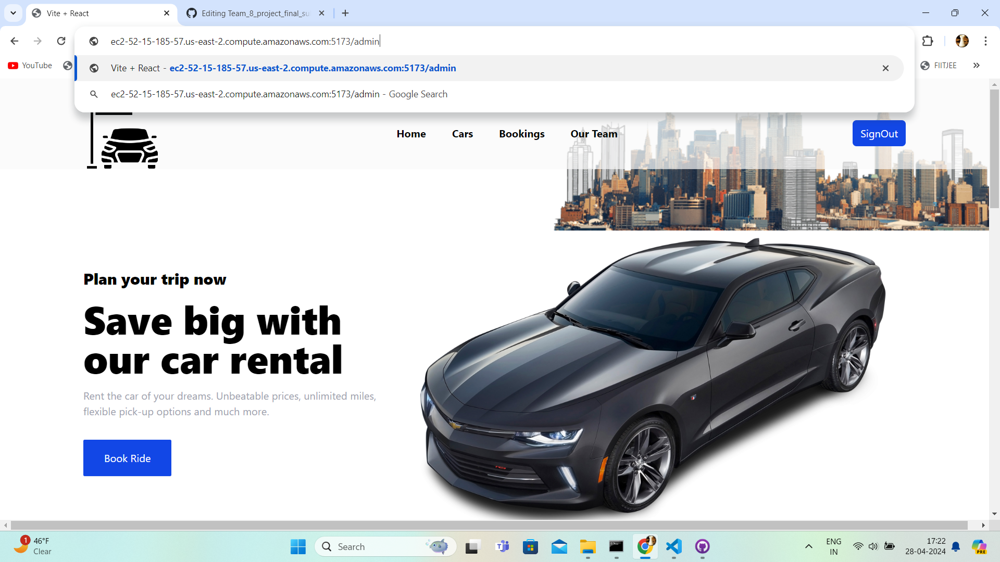

# Link of the Deployed Website:

[ec2-52-15-185-57.us-east-2.compute.amazonaws.com:5173](http://ec2-52-15-185-57.us-east-2.compute.amazonaws.com:5173)

# How to run the App:

In root directory : **npm install**

In /src : **npm run dev**

# To access admin panel :

1. Use credentials to first sign in : 

**Username**: admin@admin.com,   
**Password**: Test@132  

2. Use **/admin** after the url and press Enter. Screenshots are attached below :

## Screenshots

### Step 1

### Step 2

### Step 3

# React + Vite

This template provides a minimal setup to get React working in Vite with HMR and some ESLint rules.

Currently, two official plugins are available:

- [@vitejs/plugin-react](https://github.com/vitejs/vite-plugin-react/blob/main/packages/plugin-react/README.md) uses [Babel](https://babeljs.io/) for Fast Refresh
- [@vitejs/plugin-react-swc](https://github.com/vitejs/vite-plugin-react-swc) uses [SWC](https://swc.rs/) for Fast Refresh
